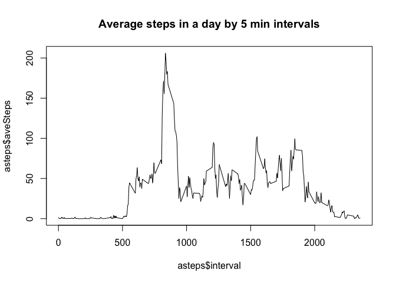
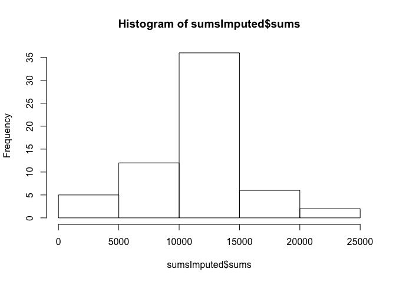
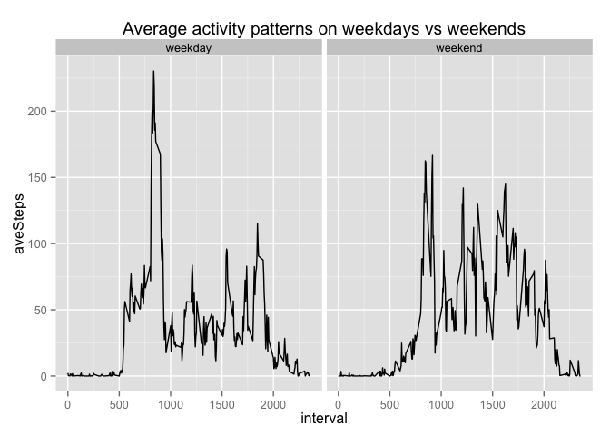

# Reproducible Research: Peer Assessment 1


## Loading and preprocessing the data

```r
activityData <- read.csv("activity.csv", header=TRUE, na.strings="NA")
str(activityData)
```

```
## 'data.frame':	17568 obs. of  3 variables:
##  $ steps   : int  NA NA NA NA NA NA NA NA NA NA ...
##  $ date    : Factor w/ 61 levels "2012-10-01","2012-10-02",..: 1 1 1 1 1 1 1 1 1 1 ...
##  $ interval: int  0 5 10 15 20 25 30 35 40 45 ...
```

## What is mean total number of steps taken per day?


```r
library("sqldf")
```

```
## Loading required package: gsubfn
## Loading required package: proto
```

```
## Warning in fun(libname, pkgname): couldn't connect to display ":0"
```

```
## Loading required package: RSQLite
## Loading required package: DBI
```

```r
sums <- sqldf("select sum(steps) sums from activityData where steps is not null group by date")
```

```
## Loading required package: tcltk
```

```r
mean(sums$sums)
```

```
## [1] 10766.19
```

## What is the average daily activity pattern?


```r
# aggregate data by interval and find ave for each interval
asteps <- sqldf("select interval, avg(steps) aveSteps from activityData where steps is not null group by interval")
# make a plot of the summary
plot(asteps$interval, asteps$aveSteps, type="l", main="Average steps in a day by 5 min intervals")
```

 

```r
# find max activity interval
sqldf("select interval, max(aveSteps) from asteps")
```

```
##   interval max(aveSteps)
## 1      835      206.1698
```

## Imputing missing values


```r
# Calculate and report the total number of missing values in the dataset (i.e. the total number of rows with NAs):
sqldf("select count(interval) from activityData where steps is null")
```

```
##   count(interval)
## 1            2304
```

```r
# replace NA values with the ave for the time interval
adImputed <- sqldf("select round(asteps.aveSteps) 'steps', activityData.date 'date', activityData.interval 'interval' from activityData, asteps where activityData.steps is null and activityData.interval = asteps.interval union select steps, date, interval from activityData where steps is not null")
# Make a histogram of the total number of steps taken each day
sumsImputed <- sqldf("select sum(steps) sums from adImputed group by date")
hist(sumsImputed$sums)
```

 

```r
# mean and median of imputed dataset
mean(sumsImputed$sums)
```

```
## [1] 10765.64
```

```r
median(sumsImputed$sums)
```

```
## [1] 10762
```

```r
# mean and median of original data
mean(sums$sums)
```

```
## [1] 10766.19
```

```r
median(sums$sums)
```

```
## [1] 10765
```

```r
# the diff in means is (%):
abs(mean(sumsImputed$sums) - mean(sums$sums)) * 100 / mean(sums$sums)
```

```
## [1] 0.005102409
```

## Are there differences in activity patterns between weekdays and weekends?


```r
# Create a new factor variable in the dataset with two levels – “weekday” and “weekend” indicating whether a given date is a weekday or weekend day.
adImputed$daysOfWeek <- weekdays(strptime(adImputed$date, "%Y-%m-%d"), abbreviate = FALSE)
adImputed$weekdays <- rep('weekday', length(adImputed$date))
adImputed$weekdays[adImputed$daysOfWeek=="Sunday"] <- 'weekend'
adImputed$weekdays[adImputed$daysOfWeek=="Saturday"] <- 'weekend'
adImputed$weekdays <- as.factor(adImputed$weekdays)
# Make a plot containing a time series plot of the 5-minute interval (x-axis) and the average number of steps taken, averaged across all weekday days or weekend days (y-axis)

awSteps <- sqldf("select interval, avg(steps) aveSteps, weekdays from adImputed group by interval, weekdays")

library("ggplot2")
```

```
## Warning: package 'ggplot2' was built under R version 3.1.3
```

```r
qplot(interval, aveSteps, data=awSteps, facets=. ~ weekdays, geom=c("line"), main="Average activity patterns on weekdays vs weekends")
```

 

